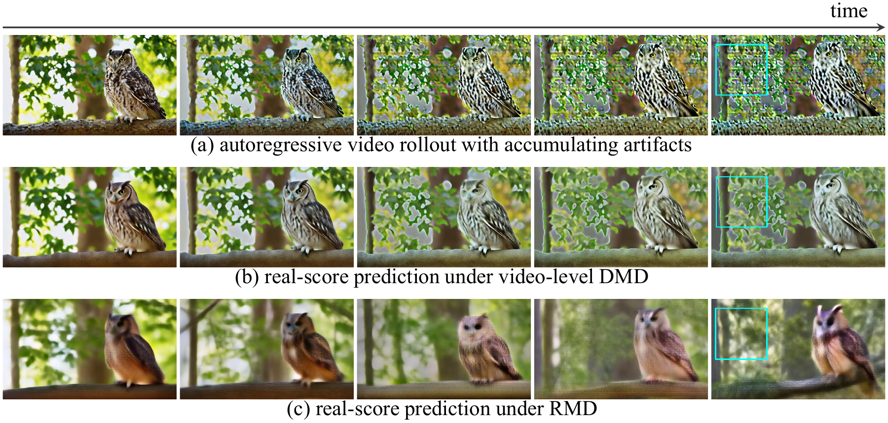
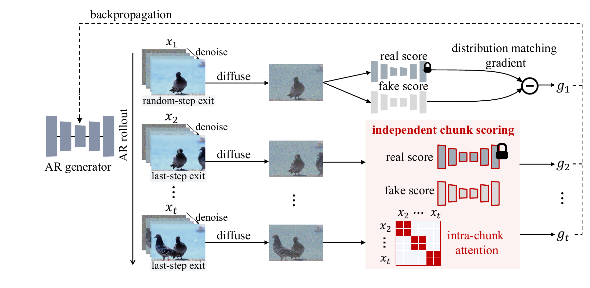

<div align="center">

# RMD
### Rollout-Marginal Distillation for Long-Horizon Autoregressive Video Generation

**Train on 5 seconds. Generate far beyond.**

[Project page](https://cjeen.github.io/RMD/) · [Paper](https://arxiv.org/pdf/2609.37925)

[Models](https://huggingface.co/cjeen/RMD) · [Quick start](#quick-start) · [How it works](#how-it-works) · [Training](#train-rmd)

</div>



*Video-level DMD can retain artifacts from the generated history.
RMD scores each chunk independently, providing a clean visual target despite degraded context.*

RMD helps autoregressive video generators preserve visual quality as they keep
generating. Trained on only 5-second rollouts, it produces minute-long videos
with substantially less visual degradation—and can be rolled out much further.

This repository includes pretrained generators, inference, and the two-stage
training implementation. CUDA and Ascend NPU execution paths are included.

## Quick start

Start with a short video to check your setup, then extend the same prompt to a
minute. Inference only needs the **Wan 1.3B assets and the final RMD generator**;
the 14B teacher and training initialization weights are for training.

### 1. Install

Use Python 3.10+ with a PyTorch/torchvision build matching your accelerator.

```bash
pip install -r requirements.txt
pip install -e .
```

For Ascend, install the compatible CANN and torch-npu stack for your platform.
FlashAttention is optional on CUDA; a PyTorch attention fallback is included.

### 2. Get the models

Download the Wan backbone, text encoder, tokenizer and VAE:

```bash
hf download Wan-AI/Wan2.1-T2V-1.3B --local-dir wan_models/Wan2.1-T2V-1.3B
```

Download the final generator from [Hugging Face](https://huggingface.co/cjeen/RMD).
No login or access request is required:

```bash
hf download cjeen/RMD stage2/model.pt --local-dir checkpoints/rmd
```

This command places the weights at `checkpoints/rmd/stage2/model.pt`, the default
inference path. Inference loads local files; it does not automatically download weights.
You do not need the full training weight bundle to infer.

| What you want to do | RMD weights to get |
| --- | --- |
| Generate videos | [`stage2/model.pt`](https://huggingface.co/cjeen/RMD/blob/main/stage2/model.pt) (≈5.68 GB) |
| Inspect the model before temporal refinement | [`stage1/model.pt`](https://huggingface.co/cjeen/RMD/blob/main/stage1/model.pt) |
| Train both stages | The `training/` assets plus official Causal Forcing initialization; see [setup](#train-rmd) |

### 3. Make your first video

```bash
python inference.py \
  --checkpoint checkpoints/rmd/stage2/model.pt \
  --prompts prompts/example.txt \
  --latent-frames 21 \
  --output outputs/first-video
```

Open `outputs/first-video/00000_00.mp4`. The example shows a happy, fuzzy panda
playing guitar beside a campfire, with a snowy mountain in the background.
To try your own scene, edit `prompts/example.txt`
or provide a text file with one prompt per line.

### 4. Let it run longer

```bash
python inference.py \
  --checkpoint checkpoints/rmd/stage2/model.pt \
  --prompts prompts/example.txt \
  --latent-frames 241 \
  --seed 0 \
  --output outputs/one-minute
```

Outputs are **832 × 480 at 16 FPS**. The length argument counts latent frames:

| Try | `--latent-frames` | Decoded video frames |
| --- | ---: | ---: |
| A quick preview, ≈5 seconds | 21 | 81 |
| A one-minute rollout | 241 | 961 |
| An extended rollout, ≈500 seconds | 2001 | 8001 |

The relationship is `video_frames = 4 × latent_frames − 3`.
The context window stays at 21 latent frames as generation grows.
VAE decoding runs in chunks; long outputs are assembled in CPU memory, so
500-second generation needs substantial host RAM as well as more runtime.

<details>
<summary>Multiple prompts, multiple devices, and model paths</summary>

Use one prompt per line. Distribute independent prompts across devices with:

```bash
torchrun --standalone --nproc_per_node=8 inference.py \
  --checkpoint checkpoints/rmd/stage2/model.pt \
  --prompts /path/to/prompts.txt \
  --latent-frames 241 --output outputs/batch
```

Select devices with `CUDA_VISIBLE_DEVICES` or `ASCEND_RT_VISIBLE_DEVICES`.
Use `--samples` for multiple outputs per prompt. Precomputed UMT5 embeddings
are supported with `--precomputed`; see the [data format](#training-data).

Set `WAN_MODEL_DIR` to the parent directory containing your Wan models.
`WAN_MODEL_ROOT` optionally overrides the 1.3B model directory alone.

</details>

## How it works

When a video teacher scores an entire generated sequence, it sees the current
frame alongside artifacts already present in its history. A correction that
removes those artifacts may conflict with temporal consistency. This coupling
can contribute to visual degradation over long rollouts.

**RMD keeps history for generation and evaluates appearance independently.**
The generator still conditions on its own previous outputs. An adapted teacher
scores each generated chunk without seeing its temporal neighbors, giving it a
visual-quality target that does not depend on matching their artifacts.



Training has two stages:

1. **Rollout-marginal distillation** improves appearance under the generator's
   own imperfect histories. Separate score pairs handle the initial frame and
   continuations. Asymmetric denoising exits preserve the temporal prior while
   refining continuation details.
2. **Video-level refinement** restores coherence across independently supervised
   chunks, using a lower learning rate and joint video scoring.

Both stages use differentiable causal replay. At inference, only the trained
causal generator, text encoder and VAE are needed—the teachers and critics stay
in training.

## Train RMD

The reference recipe uses eight devices, BF16, FSDP and a 5-second training
horizon. Install the dependencies and Wan 1.3B assets from the quick start first.
Training additionally needs Wan 14B, official Causal Forcing initialization,
and the RMD-specific score weights:

```bash
hf download Wan-AI/Wan2.1-T2V-14B --local-dir wan_models/Wan2.1-T2V-14B
hf download zhuhz22/Causal-Forcing framewise/causal_ode.pt \
  --revision 2f8eb8bb6eeb1238da9d13e5420d342a74d634a6 \
  --local-dir checkpoints/causal-forcing
hf download cjeen/RMD --include 'training/*' --local-dir checkpoints/rmd
```

The download paths match the default configurations. Stage 1 includes two
frozen 14B score networks plus trainable 1.3B models, so training requires
substantially more memory than inference.

### Training data

The reference runs use precomputed, padded Wan UMT5 embeddings of shape
`[512, 4096]`. Each line of the input JSONL has this form:

```json
{"prompt": "A fox walks through a forest.", "text_embedding_path": "embeddings/00000.npy"}
```

Relative embedding paths resolve against the JSONL directory. Ground-truth
video latents are not required. The original 70k-prompt corpus is not bundled.

### Launch training

```bash
export TRAIN_META=/path/to/train.jsonl
bash scripts/train_stage1.sh
bash scripts/train_stage2.sh
```

Stage 2 automatically initializes from stage 1's step-900 generator. The final
generator is saved at `logs/stage2/checkpoint_model_000800/model.pt`.

To start stage 2 from the released stage 1 model instead:

```bash
hf download cjeen/RMD stage1/model.pt --local-dir checkpoints/rmd
STAGE1_CKPT=checkpoints/rmd/stage1/model.pt bash scripts/train_stage2.sh
```

For plain text prompts (one per line), compute embeddings online:

```bash
bash scripts/train_stage1.sh --set data_format=text data_path=/path/to/prompts.txt
bash scripts/train_stage2.sh --set data_format=text data_path=/path/to/prompts.txt
```

<details>
<summary>Training settings and checks</summary>

| Setting | Stage 1 | Stage 2 |
| --- | --- | --- |
| Outer iterations | 900 | 800 |
| Generator / critic learning rate | 2e-5 / 2e-5 | 2e-6 / 4e-7 |
| Update schedule | 5 critic-only, then 1 generator-only | critic each iteration, generator every 5 |
| Guidance | 1 | 3 |
| Seed | 45 | randomly selected and recorded |

Both stages use AdamW with betas `(0, 0.999)` and weight decay `0.01`.
The default global batch per update is 8, without gradient accumulation.
Stage 1 reuses one prompt batch across each six-iteration cycle; stage 2 uses
separate generator and critic batches. Checkpoints do not support exact
optimizer-state resumption.

Select devices with `CUDA_VISIBLE_DEVICES` or `ASCEND_RT_VISIBLE_DEVICES`.
The launchers default to eight processes; override with `NPROC_PER_NODE`.
`PYTHON_BIN`, `LOGDIR`, `CAUSAL_ODE_CKPT`, `TEACHER_LORA`, `FAKE_SCORE_CKPT`
and `STAGE1_CKPT` override executable, output and checkpoint paths.
W&B is off by default; pass `--wandb` to enable it.

Validate configuration and input paths without loading models:

```bash
python train.py --config_path configs/stage1.yaml --validate-only
```

Use `--set max_steps=1` for a training smoke run; this still loads all models.
The cleaned release has CPU logic and checkpoint-integrity tests, but has not
been independently validated with a full accelerator training or inference run.

</details>

## Explore the implementation

| Component | Code |
| --- | --- |
| Independent scoring and initial-frame supervision | [RMD objective](model/text_frame_dmd_replay_first_frame_dmd.py) |
| Generated history and differentiable replay | [Replay](model/text_frame_dmd_replay.py) |
| Temporal refinement | [Video DMD](model/video_dmd_replay.py) |
| Rollout trajectories and denoising exits | [Training pipeline](pipeline/self_forcing_training.py) |
| Sliding attention and replay masks | [Causal backbone](wan/modules/causal_model.py) |
| FSDP, optimizers and checkpoints | [Trainer](trainer/distillation.py) |

For weight export and integrity checks, use `python scripts/export_release.py --help`
and `python scripts/verify_release.py --help`. Export requires an explicit
`--model-card /path/to/README.md`; the Hugging Face model card is maintained separately.

## Acknowledgements

Built on [Self Forcing](https://github.com/guandeh17/Self-Forcing) and
[Wan](https://github.com/Wan-Video/Wan2.1), with causal ODE initialization from
Causal Forcing and the checkpointed self-forcing replay formulation credited to
Solaris.

The code uses the existing Apache-2.0 license. Pretrained assets retain their
upstream terms; see [third-party notices](THIRD_PARTY_NOTICES.md).
